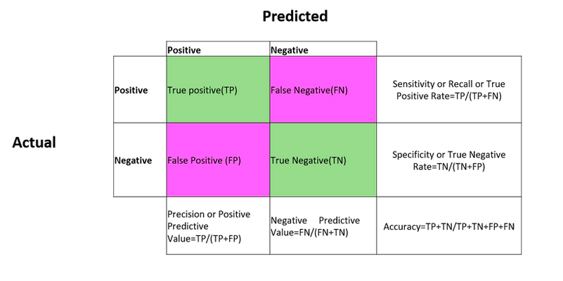
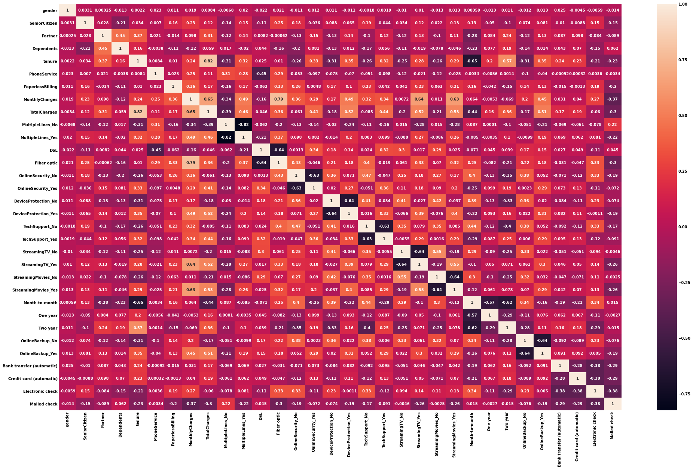
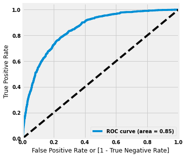
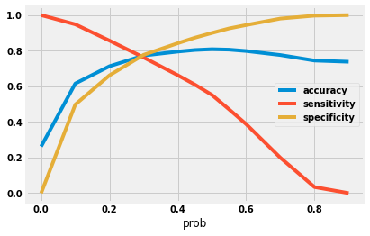
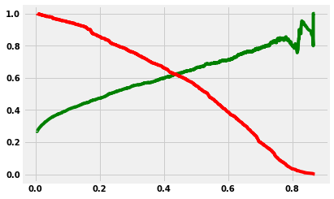

## CONDICIONES DEL MODELO LOGÍSTICO

La regresión logística no requiere de ciertas condiciones como linealidad, normalidad y homocedasticidad de los residuos que sí lo son para la regresión lineal. Las principales condiciones que este modelo requiere son:

• Respuesta binaria: La variable dependiente ha de ser binaria.

• Independencia: las observaciones han de ser independientes.

• Multicolinealidad: se requiere de muy poca a ninguna multicolinealidad entre los predictores (para regresión logística múltiple).

• Linealidad entre la variable independiente y el logaritmo natural de odds.

• Tamaño muestral: como regla general, se requiere un mínimo de 10 casos con el resultado menos frecuente para cada variable independiente del modelo

* **Variance Inflation Factor:** Variance inflation factor (VIF) is a measure of the amount of multicollinearity in a set of multiple regression variables. Mathematically, the VIF for a regression model variable is equal to the ratio of the overall model variance to the variance of a model that includes only that single independent variable. This ratio is calculated for each independent variable. A high VIF indicates that the associated independent variable is highly collinear with the other variables in the model.

* **Area Under The Curve Receiver Operating Characteristics (ROC AUC Curve):**  is a performance measurement for the classification problems at various threshold settings. ROC is a probability curve and AUC represents the degree or measure of separability. It tells how much the model is capable of distinguishing between classes. Higher the AUC, the better the model is at predicting 0 classes as 0 and 1 classes as 1. By analogy, the Higher the AUC, the better the model is at distinguishing between patients with the disease and no disease.

* **RFE Recursive Feature Elimination:** Is popular because it is easy to configure and use and because it is effective at selecting those features (columns) in a training dataset that are more or most relevant in predicting the target variable.There are two important configuration options when using RFE: the choice in the number of features to select and the choice of the algorithm used to help choose features. Both of these hyperparameters can be explored, although the performance of the method is not strongly dependent on these hyperparameters being configured well.
    * RFE is an efficient approach for eliminating features from a training dataset for feature selection.
    * How to use RFE for feature selection for classification and regression predictive modeling problems.
    * How to explore the number of selected features and wrapped algorithm used by the RFE procedure.


```python
from IPython.display import Image
Image(filename='confusion matrix5.png')
```





```python
import pandas as pd
import numpy as np
import matplotlib.pyplot as plt
import seaborn as sns
plt.rcParams['figure.figsize'] = [15,10]
plt.rcParams['font.size'] = 14
plt.rcParams['font.weight'] = 'bold'
plt.style.use('fivethirtyeight')

import warnings
warnings.filterwarnings('ignore')

from sklearn.model_selection import train_test_split
import statsmodels.api as sm

from sklearn.metrics import mean_squared_error, r2_score

import pickle 
import joblib
import os
```


```python
df = pd.read_csv('customer_data.csv')
df2 = pd.read_csv('internet_data.csv')
df3 = pd.read_csv('churn_data.csv')
```


```python
df = df.merge(df2, how='inner', on='customerID')
df = df.merge(df3, how='inner', on='customerID')
```


```python
df['TotalCharges'] = df['TotalCharges'].apply(lambda x: np.where(x==' ', np.nan, x))
df['TotalCharges'] = df['TotalCharges'].astype(float)
df.dropna(how='any',axis=0, inplace=True)
```


```python
df.columns
```


    Index(['customerID', 'gender', 'SeniorCitizen', 'Partner', 'Dependents',
           'MultipleLines', 'InternetService', 'OnlineSecurity', 'OnlineBackup',
           'DeviceProtection', 'TechSupport', 'StreamingTV', 'StreamingMovies',
           'tenure', 'PhoneService', 'Contract', 'PaperlessBilling',
           'PaymentMethod', 'MonthlyCharges', 'TotalCharges', 'Churn'],
          dtype='object')


```python
df.info()
```

    <class 'pandas.core.frame.DataFrame'>
    Int64Index: 7031 entries, 0 to 7041
    Data columns (total 21 columns):
     #   Column            Non-Null Count  Dtype  
    ---  ------            --------------  -----  
     0   customerID        7031 non-null   object 
     1   gender            7031 non-null   object 
     2   SeniorCitizen     7031 non-null   int64  
     3   Partner           7031 non-null   object 
     4   Dependents        7031 non-null   object 
     5   MultipleLines     7031 non-null   object 
     6   InternetService   7031 non-null   object 
     7   OnlineSecurity    7031 non-null   object 
     8   OnlineBackup      7031 non-null   object 
     9   DeviceProtection  7031 non-null   object 
     10  TechSupport       7031 non-null   object 
     11  StreamingTV       7031 non-null   object 
     12  StreamingMovies   7031 non-null   object 
     13  tenure            7031 non-null   int64  
     14  PhoneService      7031 non-null   object 
     15  Contract          7031 non-null   object 
     16  PaperlessBilling  7031 non-null   object 
     17  PaymentMethod     7031 non-null   object 
     18  MonthlyCharges    7031 non-null   float64
     19  TotalCharges      7031 non-null   float64
     20  Churn             7031 non-null   object 
    dtypes: float64(2), int64(2), object(17)
    memory usage: 1.2+ MB


```python
df['tenure'].value_counts()
```


    1     613
    72    362
    2     238
    3     200
    4     176
         ... 
    38     59
    28     57
    39     56
    44     51
    36     50
    Name: tenure, Length: 72, dtype: int64


```python
list(df.columns)
```


    ['customerID',
     'gender',
     'SeniorCitizen',
     'Partner',
     'Dependents',
     'MultipleLines',
     'InternetService',
     'OnlineSecurity',
     'OnlineBackup',
     'DeviceProtection',
     'TechSupport',
     'StreamingTV',
     'StreamingMovies',
     'tenure',
     'PhoneService',
     'Contract',
     'PaperlessBilling',
     'PaymentMethod',
     'MonthlyCharges',
     'TotalCharges',
     'Churn']


```python
binary_ = ['PaperlessBilling','PhoneService','Partner','Churn','Dependents']

def binary_conversion(x):
    return x.map({'Yes': 1, 'No': 0})
df[binary_] = df[binary_].apply(binary_conversion)
```


```python
df.head()
```


<div>
<style scoped>
    .dataframe tbody tr th:only-of-type {
        vertical-align: middle;
    }

    .dataframe tbody tr th {
        vertical-align: top;
    }

    .dataframe thead th {
        text-align: right;
    }
</style>
<table border="1" class="dataframe">
  <thead>
    <tr style="text-align: right;">
      <th></th>
      <th>customerID</th>
      <th>gender</th>
      <th>SeniorCitizen</th>
      <th>Partner</th>
      <th>Dependents</th>
      <th>MultipleLines</th>
      <th>InternetService</th>
      <th>OnlineSecurity</th>
      <th>OnlineBackup</th>
      <th>DeviceProtection</th>
      <th>...</th>
      <th>StreamingTV</th>
      <th>StreamingMovies</th>
      <th>tenure</th>
      <th>PhoneService</th>
      <th>Contract</th>
      <th>PaperlessBilling</th>
      <th>PaymentMethod</th>
      <th>MonthlyCharges</th>
      <th>TotalCharges</th>
      <th>Churn</th>
    </tr>
  </thead>
  <tbody>
    <tr>
      <th>0</th>
      <td>7590-VHVEG</td>
      <td>Female</td>
      <td>0</td>
      <td>1</td>
      <td>0</td>
      <td>No phone service</td>
      <td>DSL</td>
      <td>No</td>
      <td>Yes</td>
      <td>No</td>
      <td>...</td>
      <td>No</td>
      <td>No</td>
      <td>1</td>
      <td>0</td>
      <td>Month-to-month</td>
      <td>1</td>
      <td>Electronic check</td>
      <td>29.85</td>
      <td>29.85</td>
      <td>0</td>
    </tr>
    <tr>
      <th>1</th>
      <td>5575-GNVDE</td>
      <td>Male</td>
      <td>0</td>
      <td>0</td>
      <td>0</td>
      <td>No</td>
      <td>DSL</td>
      <td>Yes</td>
      <td>No</td>
      <td>Yes</td>
      <td>...</td>
      <td>No</td>
      <td>No</td>
      <td>34</td>
      <td>1</td>
      <td>One year</td>
      <td>0</td>
      <td>Mailed check</td>
      <td>56.95</td>
      <td>1889.50</td>
      <td>0</td>
    </tr>
    <tr>
      <th>2</th>
      <td>3668-QPYBK</td>
      <td>Male</td>
      <td>0</td>
      <td>0</td>
      <td>0</td>
      <td>No</td>
      <td>DSL</td>
      <td>Yes</td>
      <td>Yes</td>
      <td>No</td>
      <td>...</td>
      <td>No</td>
      <td>No</td>
      <td>2</td>
      <td>1</td>
      <td>Month-to-month</td>
      <td>1</td>
      <td>Mailed check</td>
      <td>53.85</td>
      <td>108.15</td>
      <td>1</td>
    </tr>
    <tr>
      <th>3</th>
      <td>7795-CFOCW</td>
      <td>Male</td>
      <td>0</td>
      <td>0</td>
      <td>0</td>
      <td>No phone service</td>
      <td>DSL</td>
      <td>Yes</td>
      <td>No</td>
      <td>Yes</td>
      <td>...</td>
      <td>No</td>
      <td>No</td>
      <td>45</td>
      <td>0</td>
      <td>One year</td>
      <td>0</td>
      <td>Bank transfer (automatic)</td>
      <td>42.30</td>
      <td>1840.75</td>
      <td>0</td>
    </tr>
    <tr>
      <th>4</th>
      <td>9237-HQITU</td>
      <td>Female</td>
      <td>0</td>
      <td>0</td>
      <td>0</td>
      <td>No</td>
      <td>Fiber optic</td>
      <td>No</td>
      <td>No</td>
      <td>No</td>
      <td>...</td>
      <td>No</td>
      <td>No</td>
      <td>2</td>
      <td>1</td>
      <td>Month-to-month</td>
      <td>1</td>
      <td>Electronic check</td>
      <td>70.70</td>
      <td>151.65</td>
      <td>1</td>
    </tr>
  </tbody>
</table>
<p>5 rows × 21 columns</p>
</div>


```python
multiple_l = pd.get_dummies(df['MultipleLines'], prefix='MultipleLines')
ml = multiple_l.drop(['MultipleLines_No phone service'], 1)
df = pd.concat([df, ml], axis=1)
```


```python
internet_service = pd.get_dummies(df.InternetService)
internet_service = internet_service.drop(['No'], axis=1)
df = pd.concat([df, internet_service], axis=1)
```


```python
On_sec = pd.get_dummies(df['OnlineSecurity'], prefix='OnlineSecurity')
On_sec = On_sec.drop(['OnlineSecurity_No internet service'], 1)
df = pd.concat([df, On_sec], axis=1)
```


```python
dev_protection = pd.get_dummies(df['DeviceProtection'], prefix='DeviceProtection')
dev_protection = dev_protection.drop(['DeviceProtection_No internet service'], 1)
df = pd.concat([df, dev_protection], axis=1)
```


```python
ts = pd.get_dummies(df['TechSupport'], prefix='TechSupport')
ts1 = ts.drop(['TechSupport_No internet service'], 1)
df = pd.concat([df,ts1], axis=1)

st =pd.get_dummies(df['StreamingTV'], prefix='StreamingTV')
st1 = st.drop(['StreamingTV_No internet service'], 1)
df = pd.concat([df,st1], axis=1)

sm = pd.get_dummies(df['StreamingMovies'], prefix='StreamingMovies')
sm1 = sm.drop(['StreamingMovies_No internet service'], 1)
df = pd.concat([df,sm1], axis=1)
```


```python
def gender_mapping(x):
    return x.map({'Female': 1, 'Male': 0})
df['gender'] = df[['gender']].apply(gender_mapping)
```


```python
cc = pd.get_dummies(df.Contract)
df = pd.concat([df,cc], axis=1)
```


```python
# Creating dummy variables for the variable 'OnlineBackup'.
ob = pd.get_dummies(df['OnlineBackup'], prefix='OnlineBackup')
ob1 = ob.drop(['OnlineBackup_No internet service'], 1)
# Adding the results to the master dataframe
df = pd.concat([df,ob1], axis=1)

pm = pd.get_dummies(df.PaymentMethod)
# Adding the results to the master dataframe
df = pd.concat([df,pm], axis=1)
```


```python
df.head()
```


<div>
<style scoped>
    .dataframe tbody tr th:only-of-type {
        vertical-align: middle;
    }

    .dataframe tbody tr th {
        vertical-align: top;
    }

    .dataframe thead th {
        text-align: right;
    }
</style>
<table border="1" class="dataframe">
  <thead>
    <tr style="text-align: right;">
      <th></th>
      <th>customerID</th>
      <th>gender</th>
      <th>SeniorCitizen</th>
      <th>Partner</th>
      <th>Dependents</th>
      <th>MultipleLines</th>
      <th>InternetService</th>
      <th>OnlineSecurity</th>
      <th>OnlineBackup</th>
      <th>DeviceProtection</th>
      <th>...</th>
      <th>StreamingMovies_Yes</th>
      <th>Month-to-month</th>
      <th>One year</th>
      <th>Two year</th>
      <th>OnlineBackup_No</th>
      <th>OnlineBackup_Yes</th>
      <th>Bank transfer (automatic)</th>
      <th>Credit card (automatic)</th>
      <th>Electronic check</th>
      <th>Mailed check</th>
    </tr>
  </thead>
  <tbody>
    <tr>
      <th>0</th>
      <td>7590-VHVEG</td>
      <td>1</td>
      <td>0</td>
      <td>1</td>
      <td>0</td>
      <td>No phone service</td>
      <td>DSL</td>
      <td>No</td>
      <td>Yes</td>
      <td>No</td>
      <td>...</td>
      <td>0</td>
      <td>1</td>
      <td>0</td>
      <td>0</td>
      <td>0</td>
      <td>1</td>
      <td>0</td>
      <td>0</td>
      <td>1</td>
      <td>0</td>
    </tr>
    <tr>
      <th>1</th>
      <td>5575-GNVDE</td>
      <td>0</td>
      <td>0</td>
      <td>0</td>
      <td>0</td>
      <td>No</td>
      <td>DSL</td>
      <td>Yes</td>
      <td>No</td>
      <td>Yes</td>
      <td>...</td>
      <td>0</td>
      <td>0</td>
      <td>1</td>
      <td>0</td>
      <td>1</td>
      <td>0</td>
      <td>0</td>
      <td>0</td>
      <td>0</td>
      <td>1</td>
    </tr>
    <tr>
      <th>2</th>
      <td>3668-QPYBK</td>
      <td>0</td>
      <td>0</td>
      <td>0</td>
      <td>0</td>
      <td>No</td>
      <td>DSL</td>
      <td>Yes</td>
      <td>Yes</td>
      <td>No</td>
      <td>...</td>
      <td>0</td>
      <td>1</td>
      <td>0</td>
      <td>0</td>
      <td>0</td>
      <td>1</td>
      <td>0</td>
      <td>0</td>
      <td>0</td>
      <td>1</td>
    </tr>
    <tr>
      <th>3</th>
      <td>7795-CFOCW</td>
      <td>0</td>
      <td>0</td>
      <td>0</td>
      <td>0</td>
      <td>No phone service</td>
      <td>DSL</td>
      <td>Yes</td>
      <td>No</td>
      <td>Yes</td>
      <td>...</td>
      <td>0</td>
      <td>0</td>
      <td>1</td>
      <td>0</td>
      <td>1</td>
      <td>0</td>
      <td>1</td>
      <td>0</td>
      <td>0</td>
      <td>0</td>
    </tr>
    <tr>
      <th>4</th>
      <td>9237-HQITU</td>
      <td>1</td>
      <td>0</td>
      <td>0</td>
      <td>0</td>
      <td>No</td>
      <td>Fiber optic</td>
      <td>No</td>
      <td>No</td>
      <td>No</td>
      <td>...</td>
      <td>0</td>
      <td>1</td>
      <td>0</td>
      <td>0</td>
      <td>1</td>
      <td>0</td>
      <td>0</td>
      <td>0</td>
      <td>1</td>
      <td>0</td>
    </tr>
  </tbody>
</table>
<p>5 rows × 44 columns</p>
</div>


```python
df = df.drop(['MultipleLines', 'InternetService', 'OnlineSecurity','OnlineBackup', 
                              'DeviceProtection', 'TechSupport','StreamingTV', 'StreamingMovies'], axis=1)
df = df.drop(['PaymentMethod','Contract'], axis=1)
```


```python
from sklearn.model_selection import train_test_split
```


```python
X = df.drop(['customerID', 'Churn'], axis=1)
y = df['Churn'].copy()
```


```python
X_train, X_test, y_train, y_test = train_test_split(X,y, test_size=0.3, random_state=10)
```

## Feature scaling


```python
from sklearn.preprocessing import StandardScaler
scaler = StandardScaler()
```


```python
to_scale = ['tenure','MonthlyCharges','TotalCharges']
X_train[to_scale] = scaler.fit_transform(X_train[to_scale])
```


```python
X_train.sample(5)
```


<div>
<style scoped>
    .dataframe tbody tr th:only-of-type {
        vertical-align: middle;
    }

    .dataframe tbody tr th {
        vertical-align: top;
    }

    .dataframe thead th {
        text-align: right;
    }
</style>
<table border="1" class="dataframe">
  <thead>
    <tr style="text-align: right;">
      <th></th>
      <th>gender</th>
      <th>SeniorCitizen</th>
      <th>Partner</th>
      <th>Dependents</th>
      <th>tenure</th>
      <th>PhoneService</th>
      <th>PaperlessBilling</th>
      <th>MonthlyCharges</th>
      <th>TotalCharges</th>
      <th>MultipleLines_No</th>
      <th>...</th>
      <th>StreamingMovies_Yes</th>
      <th>Month-to-month</th>
      <th>One year</th>
      <th>Two year</th>
      <th>OnlineBackup_No</th>
      <th>OnlineBackup_Yes</th>
      <th>Bank transfer (automatic)</th>
      <th>Credit card (automatic)</th>
      <th>Electronic check</th>
      <th>Mailed check</th>
    </tr>
  </thead>
  <tbody>
    <tr>
      <th>2597</th>
      <td>0</td>
      <td>0</td>
      <td>1</td>
      <td>0</td>
      <td>1.545815</td>
      <td>1</td>
      <td>1</td>
      <td>1.473859</td>
      <td>2.429975</td>
      <td>0</td>
      <td>...</td>
      <td>1</td>
      <td>0</td>
      <td>1</td>
      <td>0</td>
      <td>0</td>
      <td>1</td>
      <td>0</td>
      <td>0</td>
      <td>1</td>
      <td>0</td>
    </tr>
    <tr>
      <th>3311</th>
      <td>1</td>
      <td>0</td>
      <td>0</td>
      <td>0</td>
      <td>0.612665</td>
      <td>0</td>
      <td>1</td>
      <td>-0.670625</td>
      <td>-0.095449</td>
      <td>0</td>
      <td>...</td>
      <td>0</td>
      <td>1</td>
      <td>0</td>
      <td>0</td>
      <td>0</td>
      <td>1</td>
      <td>0</td>
      <td>0</td>
      <td>1</td>
      <td>0</td>
    </tr>
    <tr>
      <th>562</th>
      <td>0</td>
      <td>0</td>
      <td>1</td>
      <td>1</td>
      <td>-1.050776</td>
      <td>1</td>
      <td>0</td>
      <td>0.153412</td>
      <td>-0.793130</td>
      <td>1</td>
      <td>...</td>
      <td>1</td>
      <td>1</td>
      <td>0</td>
      <td>0</td>
      <td>1</td>
      <td>0</td>
      <td>0</td>
      <td>1</td>
      <td>0</td>
      <td>0</td>
    </tr>
    <tr>
      <th>1049</th>
      <td>1</td>
      <td>0</td>
      <td>0</td>
      <td>0</td>
      <td>-1.294206</td>
      <td>1</td>
      <td>0</td>
      <td>-1.502937</td>
      <td>-1.011210</td>
      <td>1</td>
      <td>...</td>
      <td>0</td>
      <td>1</td>
      <td>0</td>
      <td>0</td>
      <td>0</td>
      <td>0</td>
      <td>0</td>
      <td>0</td>
      <td>0</td>
      <td>1</td>
    </tr>
    <tr>
      <th>3406</th>
      <td>1</td>
      <td>0</td>
      <td>0</td>
      <td>0</td>
      <td>-0.077054</td>
      <td>1</td>
      <td>0</td>
      <td>-1.459915</td>
      <td>-0.719734</td>
      <td>1</td>
      <td>...</td>
      <td>0</td>
      <td>0</td>
      <td>1</td>
      <td>0</td>
      <td>0</td>
      <td>0</td>
      <td>0</td>
      <td>0</td>
      <td>0</td>
      <td>1</td>
    </tr>
  </tbody>
</table>
<p>5 rows × 32 columns</p>
</div>


```python
plt.figure(figsize=(30,20))
sns.heatmap(X_train.corr(), annot=True)
plt.show()
```





```python
correlated = ['MultipleLines_No', 'OnlineSecurity_No', 'OnlineBackup_No', 'DeviceProtection_No', 'TechSupport_No', 
                 'StreamingTV_No', 'StreamingMovies_No']
X_train = X_train.drop(correlated, axis=1)
X_test = X_test.drop(correlated, axis=1)
```


```python
from sklearn.feature_selection import RFE
from sklearn.linear_model import LogisticRegression
```


```python
log_reg = LogisticRegression()
rfe = RFE(log_reg, 15)
rfe = rfe.fit(X_train, y_train)
```


```python
rfe_df = pd.DataFrame({'columns': list(X_train.columns), 'rank' : rfe.ranking_, 'support' : rfe.support_ }).sort_values(by='rank', ascending=True)
rfe_df
```


<div>
<style scoped>
    .dataframe tbody tr th:only-of-type {
        vertical-align: middle;
    }

    .dataframe tbody tr th {
        vertical-align: top;
    }

    .dataframe thead th {
        text-align: right;
    }
</style>
<table border="1" class="dataframe">
  <thead>
    <tr style="text-align: right;">
      <th></th>
      <th>columns</th>
      <th>rank</th>
      <th>support</th>
    </tr>
  </thead>
  <tbody>
    <tr>
      <th>12</th>
      <td>OnlineSecurity_Yes</td>
      <td>1</td>
      <td>True</td>
    </tr>
    <tr>
      <th>14</th>
      <td>TechSupport_Yes</td>
      <td>1</td>
      <td>True</td>
    </tr>
    <tr>
      <th>13</th>
      <td>DeviceProtection_Yes</td>
      <td>1</td>
      <td>True</td>
    </tr>
    <tr>
      <th>23</th>
      <td>Electronic check</td>
      <td>1</td>
      <td>True</td>
    </tr>
    <tr>
      <th>11</th>
      <td>Fiber optic</td>
      <td>1</td>
      <td>True</td>
    </tr>
    <tr>
      <th>10</th>
      <td>DSL</td>
      <td>1</td>
      <td>True</td>
    </tr>
    <tr>
      <th>17</th>
      <td>Month-to-month</td>
      <td>1</td>
      <td>True</td>
    </tr>
    <tr>
      <th>8</th>
      <td>TotalCharges</td>
      <td>1</td>
      <td>True</td>
    </tr>
    <tr>
      <th>19</th>
      <td>Two year</td>
      <td>1</td>
      <td>True</td>
    </tr>
    <tr>
      <th>6</th>
      <td>PaperlessBilling</td>
      <td>1</td>
      <td>True</td>
    </tr>
    <tr>
      <th>5</th>
      <td>PhoneService</td>
      <td>1</td>
      <td>True</td>
    </tr>
    <tr>
      <th>4</th>
      <td>tenure</td>
      <td>1</td>
      <td>True</td>
    </tr>
    <tr>
      <th>20</th>
      <td>OnlineBackup_Yes</td>
      <td>1</td>
      <td>True</td>
    </tr>
    <tr>
      <th>1</th>
      <td>SeniorCitizen</td>
      <td>1</td>
      <td>True</td>
    </tr>
    <tr>
      <th>7</th>
      <td>MonthlyCharges</td>
      <td>1</td>
      <td>True</td>
    </tr>
    <tr>
      <th>3</th>
      <td>Dependents</td>
      <td>2</td>
      <td>False</td>
    </tr>
    <tr>
      <th>15</th>
      <td>StreamingTV_Yes</td>
      <td>3</td>
      <td>False</td>
    </tr>
    <tr>
      <th>16</th>
      <td>StreamingMovies_Yes</td>
      <td>4</td>
      <td>False</td>
    </tr>
    <tr>
      <th>9</th>
      <td>MultipleLines_Yes</td>
      <td>5</td>
      <td>False</td>
    </tr>
    <tr>
      <th>0</th>
      <td>gender</td>
      <td>6</td>
      <td>False</td>
    </tr>
    <tr>
      <th>2</th>
      <td>Partner</td>
      <td>7</td>
      <td>False</td>
    </tr>
    <tr>
      <th>24</th>
      <td>Mailed check</td>
      <td>8</td>
      <td>False</td>
    </tr>
    <tr>
      <th>22</th>
      <td>Credit card (automatic)</td>
      <td>9</td>
      <td>False</td>
    </tr>
    <tr>
      <th>18</th>
      <td>One year</td>
      <td>10</td>
      <td>False</td>
    </tr>
    <tr>
      <th>21</th>
      <td>Bank transfer (automatic)</td>
      <td>11</td>
      <td>False</td>
    </tr>
  </tbody>
</table>
</div>


```python
rfe_columns = X_train.columns[rfe.support_]
```


```python
import statsmodels.api as sm
def get_lrm(y_train, x_train):
    lrm = sm.GLM(y_train, (sm.add_constant(x_train)), family = sm.families.Binomial())
    lrm = lrm.fit()
    print(lrm.summary())
    return lrm
```


```python
from statsmodels.stats.outliers_influence import variance_inflation_factor

def calculate_vif(df):
    vif = pd.DataFrame()
    vif['Features'] = df.columns
    vif['vif'] = [variance_inflation_factor(df.values, i) for i in range(df.shape[1])]
    vif['vif'] = round(vif['vif'],2)
    vif = vif.sort_values(by='vif', ascending=False)
    print(vif)
```

## Model 1


```python
X_train_lg_1 = X_train[rfe_columns]
log_reg_1 = get_lrm(y_train, X_train_lg_1)
```

                     Generalized Linear Model Regression Results                  
    ==============================================================================
    Dep. Variable:                  Churn   No. Observations:                 4921
    Model:                            GLM   Df Residuals:                     4905
    Model Family:                Binomial   Df Model:                           15
    Link Function:                  logit   Scale:                          1.0000
    Method:                          IRLS   Log-Likelihood:                -2008.4
    Date:                Thu, 17 Jun 2021   Deviance:                       4016.7
    Time:                        08:24:37   Pearson chi2:                 6.31e+03
    No. Iterations:                     7                                         
    Covariance Type:            nonrobust                                         
    ========================================================================================
                               coef    std err          z      P>|z|      [0.025      0.975]
    ----------------------------------------------------------------------------------------
    const                   -1.2115      0.404     -2.999      0.003      -2.003      -0.420
    SeniorCitizen            0.2507      0.101      2.486      0.013       0.053       0.448
    tenure                  -1.6283      0.187     -8.715      0.000      -1.995      -1.262
    PhoneService            -1.0473      0.191     -5.489      0.000      -1.421      -0.673
    PaperlessBilling         0.3612      0.089      4.046      0.000       0.186       0.536
    MonthlyCharges           0.6260      0.172      3.629      0.000       0.288       0.964
    TotalCharges             0.9010      0.196      4.589      0.000       0.516       1.286
    DSL                      0.3574      0.231      1.547      0.122      -0.095       0.810
    Fiber optic              0.5456      0.349      1.563      0.118      -0.139       1.230
    OnlineSecurity_Yes      -0.5600      0.105     -5.339      0.000      -0.766      -0.354
    DeviceProtection_Yes    -0.2452      0.102     -2.412      0.016      -0.444      -0.046
    TechSupport_Yes         -0.5626      0.109     -5.180      0.000      -0.775      -0.350
    Month-to-month           0.6314      0.128      4.919      0.000       0.380       0.883
    Two year                -0.8383      0.222     -3.773      0.000      -1.274      -0.403
    OnlineBackup_Yes        -0.3213      0.096     -3.330      0.001      -0.510      -0.132
    Electronic check         0.3129      0.083      3.761      0.000       0.150       0.476
    ========================================================================================


```python
X_train_lg_2 = X_train_lg_1.drop(['Fiber optic','DSL'], axis=1)
log_reg_2 = get_lrm(y_train, X_train_lg_2)
```

                     Generalized Linear Model Regression Results                  
    ==============================================================================
    Dep. Variable:                  Churn   No. Observations:                 4921
    Model:                            GLM   Df Residuals:                     4907
    Model Family:                Binomial   Df Model:                           13
    Link Function:                  logit   Scale:                          1.0000
    Method:                          IRLS   Log-Likelihood:                -2009.7
    Date:                Thu, 17 Jun 2021   Deviance:                       4019.3
    Time:                        08:27:27   Pearson chi2:                 6.23e+03
    No. Iterations:                     7                                         
    Covariance Type:            nonrobust                                         
    ========================================================================================
                               coef    std err          z      P>|z|      [0.025      0.975]
    ----------------------------------------------------------------------------------------
    const                   -0.6588      0.212     -3.103      0.002      -1.075      -0.243
    SeniorCitizen            0.2512      0.101      2.487      0.013       0.053       0.449
    tenure                  -1.5891      0.182     -8.709      0.000      -1.947      -1.231
    PhoneService            -1.2194      0.156     -7.804      0.000      -1.526      -0.913
    PaperlessBilling         0.3651      0.089      4.093      0.000       0.190       0.540
    MonthlyCharges           0.8576      0.077     11.132      0.000       0.707       1.009
    TotalCharges             0.8307      0.188      4.408      0.000       0.461       1.200
    OnlineSecurity_Yes      -0.5762      0.101     -5.699      0.000      -0.774      -0.378
    DeviceProtection_Yes    -0.2881      0.097     -2.977      0.003      -0.478      -0.098
    TechSupport_Yes         -0.5956      0.103     -5.803      0.000      -0.797      -0.394
    Month-to-month           0.6566      0.127      5.159      0.000       0.407       0.906
    Two year                -0.8413      0.222     -3.791      0.000      -1.276      -0.406
    OnlineBackup_Yes        -0.3481      0.094     -3.703      0.000      -0.532      -0.164
    Electronic check         0.3146      0.083      3.781      0.000       0.152       0.478
    ========================================================================================


**All variables are significan, check VIF of the variables**


```python
calculate_vif(X_train_lg_2)
```

                    Features    vif
    5           TotalCharges  10.16
    1                 tenure   6.90
    2           PhoneService   4.57
    9         Month-to-month   4.26
    4         MonthlyCharges   3.68
    3       PaperlessBilling   2.68
    10              Two year   2.37
    7   DeviceProtection_Yes   2.10
    11      OnlineBackup_Yes   2.06
    8        TechSupport_Yes   1.90
    12      Electronic check   1.84
    6     OnlineSecurity_Yes   1.76
    0          SeniorCitizen   1.30


```python
X_train_lg_3 = X_train_lg_2.drop(['TotalCharges'], axis=1)
log_reg_4 = get_lrm(y_train, X_train_lg_3)
```

                     Generalized Linear Model Regression Results                  
    ==============================================================================
    Dep. Variable:                  Churn   No. Observations:                 4921
    Model:                            GLM   Df Residuals:                     4908
    Model Family:                Binomial   Df Model:                           12
    Link Function:                  logit   Scale:                          1.0000
    Method:                          IRLS   Log-Likelihood:                -2019.9
    Date:                Thu, 17 Jun 2021   Deviance:                       4039.8
    Time:                        08:30:36   Pearson chi2:                 5.21e+03
    No. Iterations:                     7                                         
    Covariance Type:            nonrobust                                         
    ========================================================================================
                               coef    std err          z      P>|z|      [0.025      0.975]
    ----------------------------------------------------------------------------------------
    const                   -0.6432      0.209     -3.072      0.002      -1.053      -0.233
    SeniorCitizen            0.2558      0.101      2.523      0.012       0.057       0.455
    tenure                  -0.8578      0.064    -13.299      0.000      -0.984      -0.731
    PhoneService            -1.1263      0.150     -7.485      0.000      -1.421      -0.831
    PaperlessBilling         0.3543      0.089      3.990      0.000       0.180       0.528
    MonthlyCharges           1.0364      0.067     15.478      0.000       0.905       1.168
    OnlineSecurity_Yes      -0.5751      0.101     -5.708      0.000      -0.773      -0.378
    DeviceProtection_Yes    -0.2575      0.096     -2.674      0.008      -0.446      -0.069
    TechSupport_Yes         -0.5746      0.102     -5.623      0.000      -0.775      -0.374
    Month-to-month           0.6479      0.126      5.137      0.000       0.401       0.895
    Two year                -0.8174      0.220     -3.715      0.000      -1.249      -0.386
    OnlineBackup_Yes        -0.3195      0.093     -3.420      0.001      -0.503      -0.136
    Electronic check         0.3065      0.083      3.677      0.000       0.143       0.470
    ========================================================================================


```python
calculate_vif(X_train_lg_3)
```

                    Features   vif
    2           PhoneService  4.57
    8         Month-to-month  4.25
    3       PaperlessBilling  2.68
    1                 tenure  2.37
    9               Two year  2.35
    6   DeviceProtection_Yes  2.08
    10      OnlineBackup_Yes  2.03
    7        TechSupport_Yes  1.88
    11      Electronic check  1.82
    5     OnlineSecurity_Yes  1.75
    4         MonthlyCharges  1.63
    0          SeniorCitizen  1.30


```python
y_train_pred = log_reg_4.predict(sm.add_constant(X_train_lg_3))
y_train_pred_values = y_train_pred.values.reshape(-1)
```


```python
churn_df = pd.DataFrame({'Churn_actual': y_train.values, 'Churn_prob' : y_train_pred_values})
churn_df['Cust_ID'] = y_train.index
churn_df.head()
```


<div>
<style scoped>
    .dataframe tbody tr th:only-of-type {
        vertical-align: middle;
    }

    .dataframe tbody tr th {
        vertical-align: top;
    }

    .dataframe thead th {
        text-align: right;
    }
</style>
<table border="1" class="dataframe">
  <thead>
    <tr style="text-align: right;">
      <th></th>
      <th>Churn_actual</th>
      <th>Churn_prob</th>
      <th>Cust_ID</th>
    </tr>
  </thead>
  <tbody>
    <tr>
      <th>0</th>
      <td>0</td>
      <td>0.007799</td>
      <td>132</td>
    </tr>
    <tr>
      <th>1</th>
      <td>0</td>
      <td>0.218054</td>
      <td>6206</td>
    </tr>
    <tr>
      <th>2</th>
      <td>0</td>
      <td>0.007448</td>
      <td>5096</td>
    </tr>
    <tr>
      <th>3</th>
      <td>0</td>
      <td>0.013340</td>
      <td>3752</td>
    </tr>
    <tr>
      <th>4</th>
      <td>0</td>
      <td>0.123655</td>
      <td>3820</td>
    </tr>
  </tbody>
</table>
</div>


```python
def calc_predict(row, tresh):
    if row >= tresh:
        return 1
    else: 
        return 0
```


```python
churn_df['Churn_Pred'] = churn_df.Churn_prob.apply(lambda row: 1 if row >= 0.5 else 0)
```


```python
churn_df.head()
```


<div>
<style scoped>
    .dataframe tbody tr th:only-of-type {
        vertical-align: middle;
    }

    .dataframe tbody tr th {
        vertical-align: top;
    }

    .dataframe thead th {
        text-align: right;
    }
</style>
<table border="1" class="dataframe">
  <thead>
    <tr style="text-align: right;">
      <th></th>
      <th>Churn_actual</th>
      <th>Churn_prob</th>
      <th>Cust_ID</th>
      <th>Churn_Pred</th>
    </tr>
  </thead>
  <tbody>
    <tr>
      <th>0</th>
      <td>0</td>
      <td>0.007799</td>
      <td>132</td>
      <td>0</td>
    </tr>
    <tr>
      <th>1</th>
      <td>0</td>
      <td>0.218054</td>
      <td>6206</td>
      <td>0</td>
    </tr>
    <tr>
      <th>2</th>
      <td>0</td>
      <td>0.007448</td>
      <td>5096</td>
      <td>0</td>
    </tr>
    <tr>
      <th>3</th>
      <td>0</td>
      <td>0.013340</td>
      <td>3752</td>
      <td>0</td>
    </tr>
    <tr>
      <th>4</th>
      <td>0</td>
      <td>0.123655</td>
      <td>3820</td>
      <td>0</td>
    </tr>
  </tbody>
</table>
</div>


```python
from sklearn import metrics
```


```python
cnf_matrix = metrics.confusion_matrix(churn_df.Churn_actual, churn_df.Churn_Pred)
cnf_matrix
```


    array([[3267,  364],
           [ 579,  711]])


```python
print('Accuracy of the model : ', metrics.accuracy_score(churn_df.Churn_actual, churn_df.Churn_Pred))
```

    Accuracy of the model :  0.8083722820564926


```python
print('Recall : ', metrics.recall_score(churn_df.Churn_actual, churn_df.Churn_Pred))
```

    Recall :  0.5511627906976744


```python
print('Precision : ', metrics.precision_score(churn_df.Churn_actual, churn_df.Churn_Pred))
```

    Precision :  0.6613953488372093


```python
tn = cnf_matrix[0,0]
fn = cnf_matrix[1,0]
fp = cnf_matrix[0,1]
tp = cnf_matrix[1,1]
print(tp)
print(tn)
```

    711
    3267


```python
# Sensistivity , True Positive rate
print('Sensitivity (True Positive Rate) TP / TP + FN : ', tp / (tp + fn))
```

    Sensitivity (True Positive Rate) TP / TP + FN :  0.5511627906976744


```python
# specificity, 
print('Specificity TN / (TN + FP) : ', tn / (tn + fp))
```

    Specificity TN / (TN + FP) :  0.8997521343982374


```python
# False positive rate
print('False positive rate FP / (TN + FP) : ', fp / (tn+fp))
```

    False positive rate FP / (TN + FP) :  0.1002478656017626


```python
def draw_roc_curve(actual, probs):
    fpr, tpr, thresholds = metrics.roc_curve( actual, probs, drop_intermediate = False )
    auc_score = metrics.roc_auc_score( actual, probs )
    plt.figure(figsize=(5, 5))
    plt.plot( fpr, tpr, label='ROC curve (area = %0.2f)' % auc_score )
    plt.plot([0, 1], [0, 1], 'k--')
    plt.xlim([0.0, 1.0])
    plt.ylim([0.0, 1.05])
    plt.xlabel('False Positive Rate or [1 - True Negative Rate]')
    plt.ylabel('True Positive Rate')
    plt.legend(loc="lower right")
    plt.show()
```


```python
draw_roc_curve(churn_df.Churn_actual, churn_df.Churn_prob)

```





```python
# to the predict for different tresholds
tresholds = [float(x)/10 for x in range(10)]
tresholds.append(0.45)
tresholds.append(0.55)
tresholds = sorted(tresholds)
for i in sorted(tresholds):
    churn_df[i] = churn_df.Churn_prob.map(lambda row: 1 if row > i else 0)
churn_df.head()
```


<div>
<style scoped>
    .dataframe tbody tr th:only-of-type {
        vertical-align: middle;
    }

    .dataframe tbody tr th {
        vertical-align: top;
    }

    .dataframe thead th {
        text-align: right;
    }
</style>
<table border="1" class="dataframe">
  <thead>
    <tr style="text-align: right;">
      <th></th>
      <th>Churn_actual</th>
      <th>Churn_prob</th>
      <th>Cust_ID</th>
      <th>Churn_Pred</th>
      <th>0.0</th>
      <th>0.1</th>
      <th>0.2</th>
      <th>0.3</th>
      <th>0.4</th>
      <th>0.45</th>
      <th>0.5</th>
      <th>0.55</th>
      <th>0.6</th>
      <th>0.7</th>
      <th>0.8</th>
      <th>0.9</th>
    </tr>
  </thead>
  <tbody>
    <tr>
      <th>0</th>
      <td>0</td>
      <td>0.007799</td>
      <td>132</td>
      <td>0</td>
      <td>1</td>
      <td>0</td>
      <td>0</td>
      <td>0</td>
      <td>0</td>
      <td>0</td>
      <td>0</td>
      <td>0</td>
      <td>0</td>
      <td>0</td>
      <td>0</td>
      <td>0</td>
    </tr>
    <tr>
      <th>1</th>
      <td>0</td>
      <td>0.218054</td>
      <td>6206</td>
      <td>0</td>
      <td>1</td>
      <td>1</td>
      <td>1</td>
      <td>0</td>
      <td>0</td>
      <td>0</td>
      <td>0</td>
      <td>0</td>
      <td>0</td>
      <td>0</td>
      <td>0</td>
      <td>0</td>
    </tr>
    <tr>
      <th>2</th>
      <td>0</td>
      <td>0.007448</td>
      <td>5096</td>
      <td>0</td>
      <td>1</td>
      <td>0</td>
      <td>0</td>
      <td>0</td>
      <td>0</td>
      <td>0</td>
      <td>0</td>
      <td>0</td>
      <td>0</td>
      <td>0</td>
      <td>0</td>
      <td>0</td>
    </tr>
    <tr>
      <th>3</th>
      <td>0</td>
      <td>0.013340</td>
      <td>3752</td>
      <td>0</td>
      <td>1</td>
      <td>0</td>
      <td>0</td>
      <td>0</td>
      <td>0</td>
      <td>0</td>
      <td>0</td>
      <td>0</td>
      <td>0</td>
      <td>0</td>
      <td>0</td>
      <td>0</td>
    </tr>
    <tr>
      <th>4</th>
      <td>0</td>
      <td>0.123655</td>
      <td>3820</td>
      <td>0</td>
      <td>1</td>
      <td>1</td>
      <td>0</td>
      <td>0</td>
      <td>0</td>
      <td>0</td>
      <td>0</td>
      <td>0</td>
      <td>0</td>
      <td>0</td>
      <td>0</td>
      <td>0</td>
    </tr>
  </tbody>
</table>
</div>


```python
optimal_df = pd.DataFrame(columns=['prob', 'accuracy', 'sensitivity', 'specificity'])
for i in tresholds:
    cm = metrics.confusion_matrix(churn_df.Churn_actual, churn_df[i])
    tn = cm[0,0]
    fn = cm[1,0]
    fp = cm[0,1]
    tp = cm[1,1]
    accuracy = (tn + tp) / (tn + tp + fp + fn)
    specificity = tn / (tn + fp)
    sensitivity = tp / (tp + fn)
    optimal_df.loc[i] = [i, accuracy, sensitivity, specificity]
```


```python
optimal_df.plot(x = 'prob', y=['accuracy', 'sensitivity', 'specificity'])
plt.show()
```





```python
optimal_value = 0.3
churn_df['final_pred'] = churn_df.Churn_prob.map(lambda x: 1 if x > 0.3 else 0)
churn_df.head()
```


<div>
<style scoped>
    .dataframe tbody tr th:only-of-type {
        vertical-align: middle;
    }

    .dataframe tbody tr th {
        vertical-align: top;
    }

    .dataframe thead th {
        text-align: right;
    }
</style>
<table border="1" class="dataframe">
  <thead>
    <tr style="text-align: right;">
      <th></th>
      <th>Churn_actual</th>
      <th>Churn_prob</th>
      <th>Cust_ID</th>
      <th>Churn_Pred</th>
      <th>0.0</th>
      <th>0.1</th>
      <th>0.2</th>
      <th>0.3</th>
      <th>0.4</th>
      <th>0.45</th>
      <th>0.5</th>
      <th>0.55</th>
      <th>0.6</th>
      <th>0.7</th>
      <th>0.8</th>
      <th>0.9</th>
      <th>final_pred</th>
    </tr>
  </thead>
  <tbody>
    <tr>
      <th>0</th>
      <td>0</td>
      <td>0.007799</td>
      <td>132</td>
      <td>0</td>
      <td>1</td>
      <td>0</td>
      <td>0</td>
      <td>0</td>
      <td>0</td>
      <td>0</td>
      <td>0</td>
      <td>0</td>
      <td>0</td>
      <td>0</td>
      <td>0</td>
      <td>0</td>
      <td>0</td>
    </tr>
    <tr>
      <th>1</th>
      <td>0</td>
      <td>0.218054</td>
      <td>6206</td>
      <td>0</td>
      <td>1</td>
      <td>1</td>
      <td>1</td>
      <td>0</td>
      <td>0</td>
      <td>0</td>
      <td>0</td>
      <td>0</td>
      <td>0</td>
      <td>0</td>
      <td>0</td>
      <td>0</td>
      <td>0</td>
    </tr>
    <tr>
      <th>2</th>
      <td>0</td>
      <td>0.007448</td>
      <td>5096</td>
      <td>0</td>
      <td>1</td>
      <td>0</td>
      <td>0</td>
      <td>0</td>
      <td>0</td>
      <td>0</td>
      <td>0</td>
      <td>0</td>
      <td>0</td>
      <td>0</td>
      <td>0</td>
      <td>0</td>
      <td>0</td>
    </tr>
    <tr>
      <th>3</th>
      <td>0</td>
      <td>0.013340</td>
      <td>3752</td>
      <td>0</td>
      <td>1</td>
      <td>0</td>
      <td>0</td>
      <td>0</td>
      <td>0</td>
      <td>0</td>
      <td>0</td>
      <td>0</td>
      <td>0</td>
      <td>0</td>
      <td>0</td>
      <td>0</td>
      <td>0</td>
    </tr>
    <tr>
      <th>4</th>
      <td>0</td>
      <td>0.123655</td>
      <td>3820</td>
      <td>0</td>
      <td>1</td>
      <td>1</td>
      <td>0</td>
      <td>0</td>
      <td>0</td>
      <td>0</td>
      <td>0</td>
      <td>0</td>
      <td>0</td>
      <td>0</td>
      <td>0</td>
      <td>0</td>
      <td>0</td>
    </tr>
  </tbody>
</table>
</div>


```python
# calcualte the accuracy
final_accuracy = metrics.accuracy_score(churn_df.Churn_actual, churn_df.final_pred)
print('Final Accuracy : ', final_accuracy)
```

    Final Accuracy :  0.7728104043893518


```python
# calcualte the other parameters
final_cm = metrics.confusion_matrix(churn_df.Churn_actual, churn_df.final_pred)
print('Confusion matric \n', final_cm)
```

    Confusion matric 
     [[2820  811]
     [ 307  983]]


```python
tn = final_cm[0,0]
fn = final_cm[1,0]
fp = final_cm[0,1]
tp = final_cm[1,1]

sensitivity = tp / (tp + fn)
specificity = tn / (tn + fp)
false_positive_rate = 1 - specificity
positive_predictive_rate = tp / (tp + fp)
negative_predictive_rate = tn / (tn + fn)

print('optimal treshold : ', optimal_value)
print('sensitivity : ', sensitivity)
print('specificity : ', specificity)
print('false_positive_rate : ', false_positive_rate)
print('positive_predictive_rate : ', positive_predictive_rate)
print('negative_predictive_rate : ', negative_predictive_rate)
```

    optimal treshold :  0.3
    sensitivity :  0.762015503875969
    specificity :  0.7766455521894795
    false_positive_rate :  0.2233544478105205
    positive_predictive_rate :  0.5479375696767002
    negative_predictive_rate :  0.9018228333866326


```python
con_cm = metrics.confusion_matrix(churn_df.Churn_actual, churn_df.Churn_Pred)
con_cm
```


    array([[3267,  364],
           [ 579,  711]])


```python
# recall
recall = con_cm[1,1] / (con_cm[1,1] + con_cm[1,0])
print('Recall : ', recall)
```

    Recall :  0.5511627906976744


```python
# precision
precision = con_cm[1,1] / (con_cm[1,1] + con_cm[0,1])
print('precision : ', precision)
```

    precision :  0.6613953488372093


```python
# precision and recall trade off
from sklearn.metrics import precision_recall_curve
```


```python
p, r, tresholds = precision_recall_curve(churn_df.Churn_actual, churn_df.Churn_prob)
```


```python
plt.plot(tresholds, p[:-1], 'g-')
plt.plot(tresholds, r[:-1], 'r-')
plt.show()
```





```python
X_test[to_scale] = scaler.transform(X_test[to_scale])
X_test = X_test[X_train_lg_3.columns]
X_test.head()
```


<div>
<style scoped>
    .dataframe tbody tr th:only-of-type {
        vertical-align: middle;
    }

    .dataframe tbody tr th {
        vertical-align: top;
    }

    .dataframe thead th {
        text-align: right;
    }
</style>
<table border="1" class="dataframe">
  <thead>
    <tr style="text-align: right;">
      <th></th>
      <th>SeniorCitizen</th>
      <th>tenure</th>
      <th>PhoneService</th>
      <th>PaperlessBilling</th>
      <th>MonthlyCharges</th>
      <th>OnlineSecurity_Yes</th>
      <th>DeviceProtection_Yes</th>
      <th>TechSupport_Yes</th>
      <th>Month-to-month</th>
      <th>Two year</th>
      <th>OnlineBackup_Yes</th>
      <th>Electronic check</th>
    </tr>
  </thead>
  <tbody>
    <tr>
      <th>2678</th>
      <td>0</td>
      <td>-1.339550</td>
      <td>1</td>
      <td>0</td>
      <td>-2.202915</td>
      <td>0</td>
      <td>0</td>
      <td>0</td>
      <td>0</td>
      <td>0</td>
      <td>0</td>
      <td>0</td>
    </tr>
    <tr>
      <th>4130</th>
      <td>0</td>
      <td>-1.372472</td>
      <td>0</td>
      <td>0</td>
      <td>-2.184790</td>
      <td>0</td>
      <td>0</td>
      <td>1</td>
      <td>1</td>
      <td>0</td>
      <td>1</td>
      <td>1</td>
    </tr>
    <tr>
      <th>1180</th>
      <td>0</td>
      <td>-1.324736</td>
      <td>1</td>
      <td>1</td>
      <td>-2.169949</td>
      <td>0</td>
      <td>0</td>
      <td>1</td>
      <td>0</td>
      <td>1</td>
      <td>0</td>
      <td>0</td>
    </tr>
    <tr>
      <th>555</th>
      <td>0</td>
      <td>-1.296753</td>
      <td>1</td>
      <td>1</td>
      <td>-2.149195</td>
      <td>1</td>
      <td>1</td>
      <td>0</td>
      <td>0</td>
      <td>0</td>
      <td>0</td>
      <td>0</td>
    </tr>
    <tr>
      <th>5565</th>
      <td>0</td>
      <td>-1.359303</td>
      <td>0</td>
      <td>1</td>
      <td>-2.181723</td>
      <td>0</td>
      <td>1</td>
      <td>0</td>
      <td>1</td>
      <td>0</td>
      <td>0</td>
      <td>1</td>
    </tr>
  </tbody>
</table>
</div>


```python
# predict the X_test
y_test_pred = log_reg_4.predict(sm.add_constant(X_test))
```


```python
test_pred_df = pd.DataFrame(y_test)
test_pred_df.head()
```


<div>
<style scoped>
    .dataframe tbody tr th:only-of-type {
        vertical-align: middle;
    }

    .dataframe tbody tr th {
        vertical-align: top;
    }

    .dataframe thead th {
        text-align: right;
    }
</style>
<table border="1" class="dataframe">
  <thead>
    <tr style="text-align: right;">
      <th></th>
      <th>Churn</th>
    </tr>
  </thead>
  <tbody>
    <tr>
      <th>2678</th>
      <td>0</td>
    </tr>
    <tr>
      <th>4130</th>
      <td>0</td>
    </tr>
    <tr>
      <th>1180</th>
      <td>0</td>
    </tr>
    <tr>
      <th>555</th>
      <td>0</td>
    </tr>
    <tr>
      <th>5565</th>
      <td>1</td>
    </tr>
  </tbody>
</table>
</div>


```python
y_test_df = pd.DataFrame(y_test_pred)
y_test_df['CustID'] = y_test_df.index
y_test_df.head()
```


<div>
<style scoped>
    .dataframe tbody tr th:only-of-type {
        vertical-align: middle;
    }

    .dataframe tbody tr th {
        vertical-align: top;
    }

    .dataframe thead th {
        text-align: right;
    }
</style>
<table border="1" class="dataframe">
  <thead>
    <tr style="text-align: right;">
      <th></th>
      <th>0</th>
      <th>CustID</th>
    </tr>
  </thead>
  <tbody>
    <tr>
      <th>2678</th>
      <td>0.051980</td>
      <td>2678</td>
    </tr>
    <tr>
      <th>4130</th>
      <td>0.158423</td>
      <td>4130</td>
    </tr>
    <tr>
      <th>1180</th>
      <td>0.019461</td>
      <td>1180</td>
    </tr>
    <tr>
      <th>555</th>
      <td>0.033475</td>
      <td>555</td>
    </tr>
    <tr>
      <th>5565</th>
      <td>0.334647</td>
      <td>5565</td>
    </tr>
  </tbody>
</table>
</div>


```python
y_test_df.reset_index(drop= True, inplace=True)
test_pred_df.reset_index(drop=True, inplace=True)
```


```python
test_pred_final_df = pd.concat([ test_pred_df, y_test_df], axis=1)
test_pred_final_df.head()
```


<div>
<style scoped>
    .dataframe tbody tr th:only-of-type {
        vertical-align: middle;
    }

    .dataframe tbody tr th {
        vertical-align: top;
    }

    .dataframe thead th {
        text-align: right;
    }
</style>
<table border="1" class="dataframe">
  <thead>
    <tr style="text-align: right;">
      <th></th>
      <th>Churn</th>
      <th>0</th>
      <th>CustID</th>
    </tr>
  </thead>
  <tbody>
    <tr>
      <th>0</th>
      <td>0</td>
      <td>0.051980</td>
      <td>2678</td>
    </tr>
    <tr>
      <th>1</th>
      <td>0</td>
      <td>0.158423</td>
      <td>4130</td>
    </tr>
    <tr>
      <th>2</th>
      <td>0</td>
      <td>0.019461</td>
      <td>1180</td>
    </tr>
    <tr>
      <th>3</th>
      <td>0</td>
      <td>0.033475</td>
      <td>555</td>
    </tr>
    <tr>
      <th>4</th>
      <td>1</td>
      <td>0.334647</td>
      <td>5565</td>
    </tr>
  </tbody>
</table>
</div>


```python
test_pred_final_df= test_pred_final_df.rename(columns={0 : 'Churn_Prob', 'Churn': 'Churn_Actual'})
test_pred_final_df.head()
```


<div>
<style scoped>
    .dataframe tbody tr th:only-of-type {
        vertical-align: middle;
    }

    .dataframe tbody tr th {
        vertical-align: top;
    }

    .dataframe thead th {
        text-align: right;
    }
</style>
<table border="1" class="dataframe">
  <thead>
    <tr style="text-align: right;">
      <th></th>
      <th>Churn_Actual</th>
      <th>Churn_Prob</th>
      <th>CustID</th>
    </tr>
  </thead>
  <tbody>
    <tr>
      <th>0</th>
      <td>0</td>
      <td>0.051980</td>
      <td>2678</td>
    </tr>
    <tr>
      <th>1</th>
      <td>0</td>
      <td>0.158423</td>
      <td>4130</td>
    </tr>
    <tr>
      <th>2</th>
      <td>0</td>
      <td>0.019461</td>
      <td>1180</td>
    </tr>
    <tr>
      <th>3</th>
      <td>0</td>
      <td>0.033475</td>
      <td>555</td>
    </tr>
    <tr>
      <th>4</th>
      <td>1</td>
      <td>0.334647</td>
      <td>5565</td>
    </tr>
  </tbody>
</table>
</div>


```python
test_pred_final_df['Churn_final_pred'] = test_pred_final_df.Churn_Prob.map(lambda x : 1 if x > 0.42 else 0)
test_pred_final_df.head()
```


<div>
<style scoped>
    .dataframe tbody tr th:only-of-type {
        vertical-align: middle;
    }

    .dataframe tbody tr th {
        vertical-align: top;
    }

    .dataframe thead th {
        text-align: right;
    }
</style>
<table border="1" class="dataframe">
  <thead>
    <tr style="text-align: right;">
      <th></th>
      <th>Churn_Actual</th>
      <th>Churn_Prob</th>
      <th>CustID</th>
      <th>Churn_final_pred</th>
    </tr>
  </thead>
  <tbody>
    <tr>
      <th>0</th>
      <td>0</td>
      <td>0.051980</td>
      <td>2678</td>
      <td>0</td>
    </tr>
    <tr>
      <th>1</th>
      <td>0</td>
      <td>0.158423</td>
      <td>4130</td>
      <td>0</td>
    </tr>
    <tr>
      <th>2</th>
      <td>0</td>
      <td>0.019461</td>
      <td>1180</td>
      <td>0</td>
    </tr>
    <tr>
      <th>3</th>
      <td>0</td>
      <td>0.033475</td>
      <td>555</td>
      <td>0</td>
    </tr>
    <tr>
      <th>4</th>
      <td>1</td>
      <td>0.334647</td>
      <td>5565</td>
      <td>0</td>
    </tr>
  </tbody>
</table>
</div>


```python
test_accuracy = metrics.accuracy_score(test_pred_final_df.Churn_Actual, test_pred_final_df.Churn_final_pred)
print('Test accuracy : ', test_accuracy)
```

    Test accuracy :  0.7260663507109004


```python
test_cm = metrics.confusion_matrix(test_pred_final_df.Churn_Actual, test_pred_final_df.Churn_final_pred)
test_cm
```


    array([[1529,    2],
           [ 576,    3]])


```python
print('Test Sensitivity : ', test_cm[1,1] / (test_cm[1,1] + test_cm[1,0]))
print('Test Specificity : ', test_cm[0,0] / (test_cm[0,0] + test_cm[0,1]))
```

    Test Sensitivity :  0.0051813471502590676
    Test Specificity :  0.9986936642717178


```python
print('Final model parameters : ', X_train_lg_3.columns)
```

    Final model parameters :  Index(['SeniorCitizen', 'tenure', 'PhoneService', 'PaperlessBilling',
           'MonthlyCharges', 'OnlineSecurity_Yes', 'DeviceProtection_Yes',
           'TechSupport_Yes', 'Month-to-month', 'Two year', 'OnlineBackup_Yes',
           'Electronic check'],
          dtype='object')

